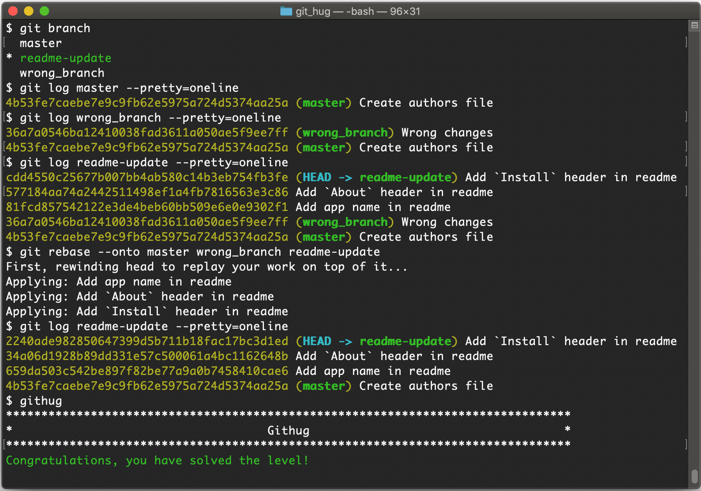

# Level 41 rebase_onto

> You've created a branch named `readme-update` from `wrong_branch`, done a few commits on it, and suddenly you realize that you shouldn't have created your branch from `wrong_branch`, but rather from `master`. Now you need to migrate the commits you made on `readme-update` to the `master` branch.

In the command

```shell
git rebase --onto master wrong_branch readme-update
```

branch `master` is defined as the new ancestor of branch `readme-update` by
`--onto` (regardless if this is the branch currently checked-out, or not) while
retaining `wrong_branch` aside.

The level 41 pass screen looks like this:


